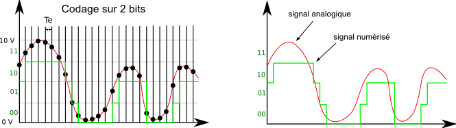

# Descrption

### PHD requirement's: Fourrier, Laplace, biot & savart, magnetism.
 
In first time i will need to be worked in proximity device from neighborhood.
Captor which used is smartphone magnet sensor B(x, y, z) [Radio](https://github.com/Maissacrement/RFSignalToolkit/blob/main/backend/radio.csv)
 
 
Technically,
I transform the oem field values in space to normal at time:
`B(t)=Bx(t)^2+By(t)^2+Bz(t)^2` give me --> [Normal](https://github.com/Maissacrement/RFSignalToolkit/blob/main/backend/core/analyse.py#L91)
 
I used this normal as amblitude
 
I make a fourrier analysis f(A)=A*e**(dtfpi): [here](https://github.com/Maissacrement/RFSignalToolkit/blob/main)

 
Signal is quantified in my CAN proportionnally at amplitude peak (1111) F

After that i identify in my step value the one that is repeated the most. Using them as refered value to quantify the other (1111). F => F+F => 1111 1111
 

 
Knowing that the signal obtained is represented in this way
 
(Time can, Intensity can)
(1111 1111) ---> 0F

Knowing that the signal obtained is represented by this We have therefore recovered a data element
To do the time can we refer to the number of times that an intensity value is repeated, i.e. the number of frequency periods. We then have:
 
(1111 1111) --> FF
This is the first period treated
So we have our first one element of our dump
The strongest intensity value is therefore the reference for proportionally deducing the other values
Then I process the dump that I shift over time under .pcap with tshark in json
