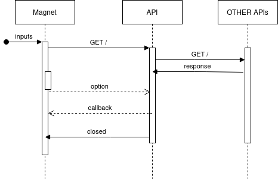
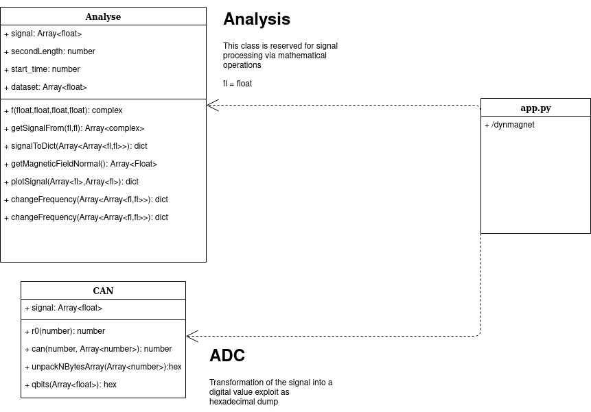
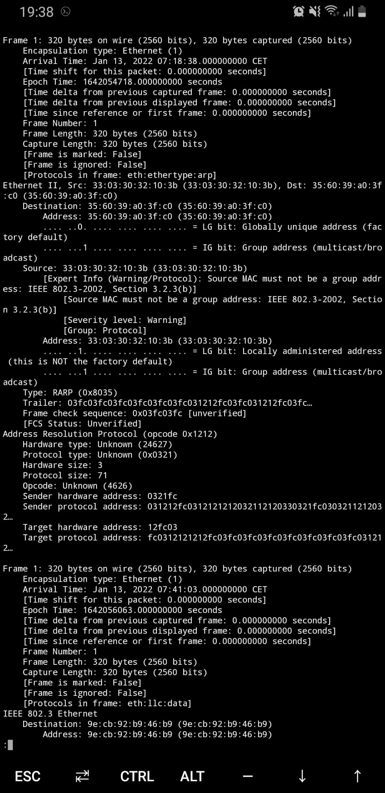

# Radio sniffer

## Welcom in Radio Sniffer Backend Tool

### How to curl

```bash
./backend/unit
```


### How to install

```bash
apt install python3 python3-pip cython libpcap-dev curl
pip3 install Cython
pip3 install -r requirement.txt
```

### How to run

Docker
```bash
make radio  (Docker + Make)
```

Python
```bash
python3 app.py
```

### Presentation







## Magnet receive frame

