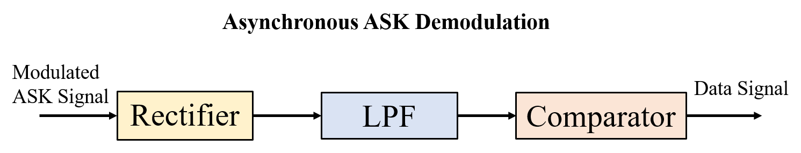
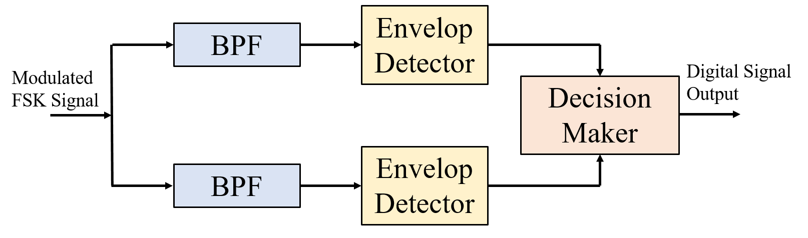
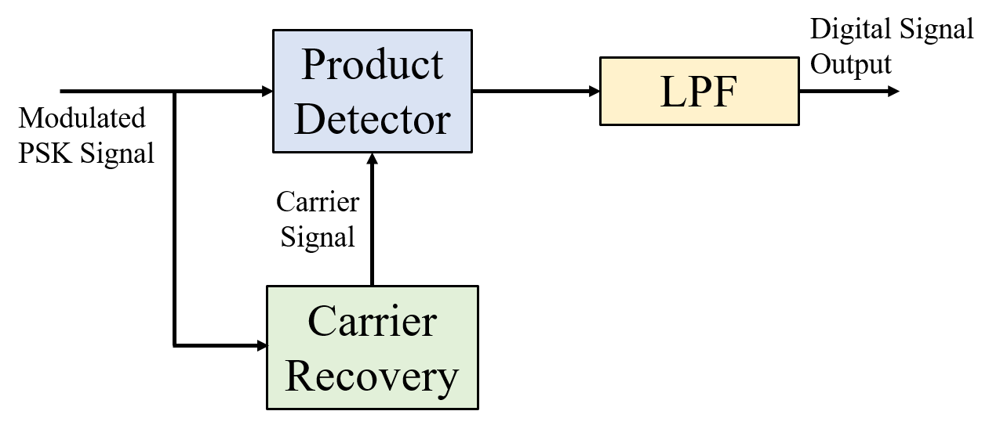

# Descrption of Our Goal

```bash
requirement: Fourrier Transform, Laplace Transfrom, biot & savart, magnetism.
 ```
In this project we are using a Smartphone Magnetic Sensor B(x, y, z) [Radio](https://github.com/Maissacrement/RFSignalToolkit/blob/main/backend/radio.csv)


## Get signal indication (rssi, power, direction)

## Compute Magnitude of the magnetic field

$$
    B(t)=\sqrt{Bx(t)^2+By(t)^2+Bz(t)^2}
$$ 
 
With the help of above formula, you can find the magnitude of Magnetic field [[here]](https://github.com/Maissacrement/RFSignalToolkit/blob/main/backend/core/analyse.py#L91).


## Fourrier analysis


$$
    x(f) = \int_{-\infty }^{\infty}x(t)e^{-j2\pi ft}dt
$$


You can find the python function for fourier transform [here](https://github.com/Maissacrement/RFSignalToolkit/blob/main/backend/core/analyse.py#L41)


## Demodulation

### ASK

Amplitude Shift Keying (ASK) signal can be demodulated and digital data can be extracted from it based on the folling FSK demodulation scheme.



### FSK
Frequency Shift Keying (ASK) signal can be demodulated and digital data can be extracted from it based on the folling FSK demodulation scheme.



### PSK

Phase Shift Keying (ASK) signal can be demodulated and digital data can be extracted from it based on the folling PSK demodulation scheme.



## Analog to digital converter (ADC, DAC)

Identify the peak from the signal: 1111 or F. The signal is quantized proportionally in frequency in numerical value.
I identify in my step value the one that repeats the most for one unit of the chosen sampling period.
The element repeated the most times in the sample becomes the maximum value of the right bit.
  Use them as a reference value to quantize the other signals (1111). F => F+F => 1111 1111

 

 
Then I process the dump that I shift in time under .pcap with tshark in json

## HOW THIS WORK

1. First select [frequency](https://github.com/Maissacrement/RFSignalToolkit/blob/main/backend/app.py#L168).

2. From [Main](https://github.com/Maissacrement/RFSignalToolkit/blob/main/backend/core/analyse.py#L135) 

    2.1.  First we need to get the Magnetic Field Magnitude[(Normal)](https://github.com/Maissacrement/RFSignalToolkit/blob/main/backend/core/analyse.py#L91).

    2.2.  Second, transform signal into a  [complex](https://github.com/Maissacrement/RFSignalToolkit/blob/main/backend/core/analyse.py#L136) frequency form before computing the [fft](https://github.com/Maissacrement/RFSignalToolkit/blob/main/backend/core/analyse.py#L41). 
    
    2.3. Get windowed data [cut](https://github.com/Maissacrement/RFSignalToolkit/blob/main/backend/core/analyse.py#L41).

    2.4. Finally, Return the [filtered data](https://github.com/Maissacrement/RFSignalToolkit/blob/main/backend/core/analyse.py#L41).

3. Init [CAN](https://github.com/Maissacrement/RFSignalToolkit/blob/main/backend/app.py#L170)
to Convert data from float into [hex dump](https://github.com/Maissacrement/RFSignalToolkit/blob/main/backend/app.py#L171). Then Convert hex dump into [ascii](https://github.com/Maissacrement/RFSignalToolkit/blob/main/backend/app.py#L175) data format.
