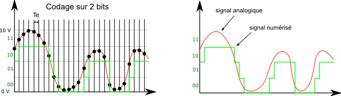

# Descrption of Our Goal

```bash
requirement: Fourrier, Laplace, biot & savart, magnetism.
 ```

Using is smartphone magnet sensor B(x, y, z) [Radio](https://github.com/Maissacrement/RFSignalToolkit/blob/main/backend/radio.csv)


## Get signal indication (rssi, power, direction)

## Compute magnetique field

$$
    B(t)=\sqrt{Bx(t)^2+By(t)^2+Bz(t)^2}
$$ 
 
Here u can found the [Normal](https://github.com/Maissacrement/RFSignalToolkit/blob/main/backend/core/analyse.py#L91). This normal is used as amplitude.


## Fourrier analysis

$$
    X(f)=B*e^{-j*t*f*pi}
$$

Here u can found fourrier analysis [here](https://github.com/Maissacrement/RFSignalToolkit/blob/main/backend/core/analyse.py#L41)


## Demodulation

### ASK

...

### FSK

...

### PSK

...

## Analog to digital converter (ADC, DAC)

Identify the peak from the signal: 1111 or F. The signal is quantized proportionally in frequency in numerical value.
I identify in my step value the one that repeats the most for one unit of the chosen sampling period.
The element repeated the most times in the sample becomes the maximum value of the right bit.
  Use them as a reference value to quantize the other signals (1111). F => F+F => 1111 1111

 

 
Then I process the dump that I shift in time under .pcap with tshark in json

## HOW THIS WORK

First select [frequency](https://github.com/Maissacrement/RFSignalToolkit/blob/main/backend/app.py#L168).

From [Main](https://github.com/Maissacrement/RFSignalToolkit/blob/main/backend/core/analyse.py#L135) we need to get [Magnetic field Normal](https://github.com/Maissacrement/RFSignalToolkit/blob/main/backend/core/analyse.py#L91). In second time, transform signal into a  [complex](https://github.com/Maissacrement/RFSignalToolkit/blob/main/backend/core/analyse.py#L136) from frequency before a [fft](https://github.com/Maissacrement/RFSignalToolkit/blob/main/backend/core/analyse.py#L41). Get windowed data [cut](https://github.com/Maissacrement/RFSignalToolkit/blob/main/backend/core/analyse.py#L41).
Return [filtered data](https://github.com/Maissacrement/RFSignalToolkit/blob/main/backend/core/analyse.py#L41).

Init [CAN](https://github.com/Maissacrement/RFSignalToolkit/blob/main/backend/app.py#L170)
Convert data float into [hex dump](https://github.com/Maissacrement/RFSignalToolkit/blob/main/backend/app.py#L171). Convert hex dump in [ascii](https://github.com/Maissacrement/RFSignalToolkit/blob/main/backend/app.py#L175)